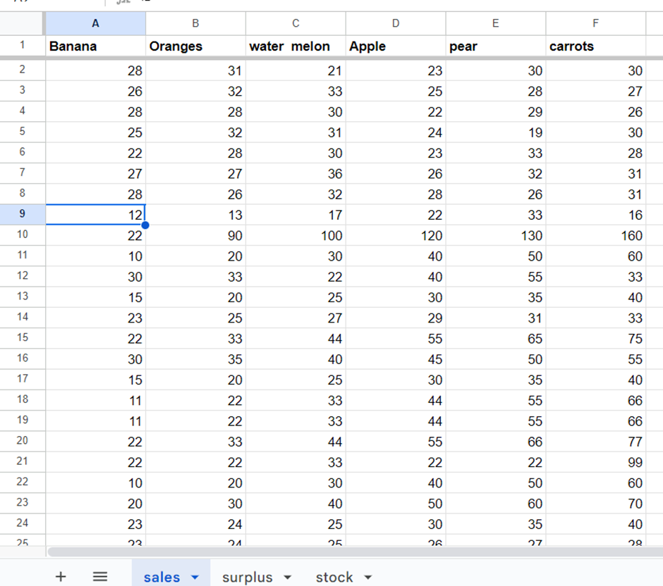
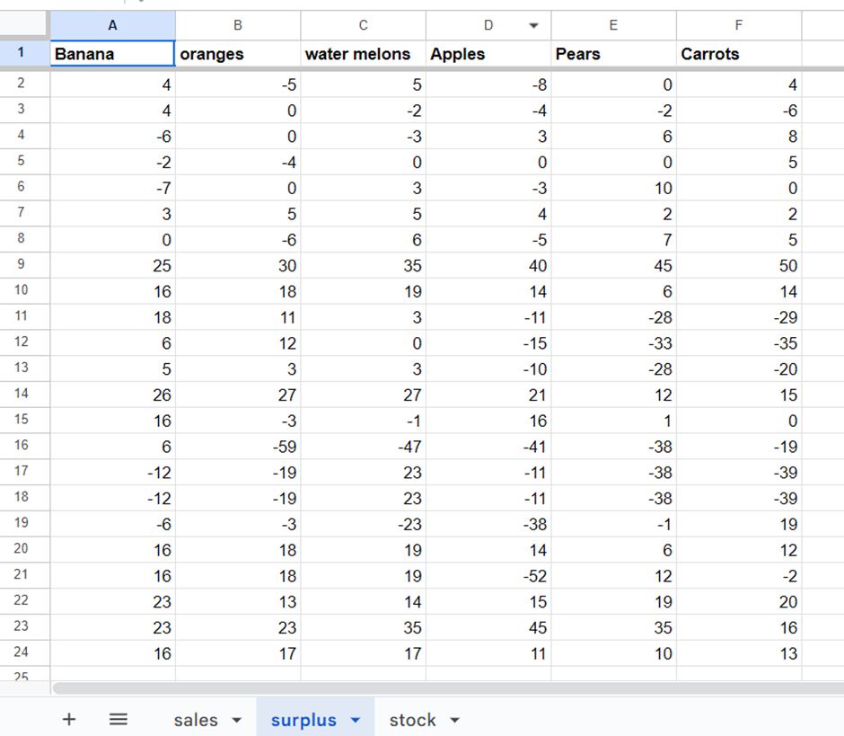
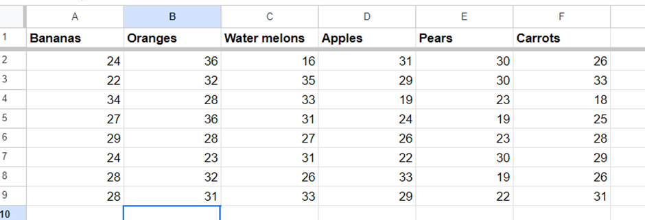

**README: Love Fruits Automation System**

**Introduction:**

Welcome to the Love Fruits Automation System! This project aims to simplify the process of managing fruit market data through automation. Whether you're a student working on a project or an enthusiast interested in optimizing market management, this system is designed to streamline your tasks effectively.

**Aims:**

1. **Efficiency:** Reduce the time and effort required for data entry and calculation tasks.
2. **Accuracy:** Ensure precise calculations and data management, minimizing errors.
3. **Convenience:** Provide a user-friendly interface for seamless interaction and operation.

**How to Use:**

1. **Set Up Google Sheets:** Ensure you have access to Google Sheets and have a spreadsheet named "LoveFruits" created.
2. **Install Dependencies:** Make sure you have the required dependencies installed, including `gspread` and `google.oauth2`.
3. **Provide Credentials:** Prepare your Google service account credentials in a JSON file named "creds.json" to enable access to Google Sheets.
4. **Run the Code:** Execute the provided Python script to launch the Love Fruits Automation System.
5. **Enter Data:** Follow the prompts to enter sales information for the last market, specifying sales numbers for various fruits.
6. **Choose Calculation:** Select the desired calculation option (AVG, TOT, or MED) to compute the average, total, or median stock data, respectively.
7. **Review Results:** View the calculated stock data provided by the system for your analysis and decision-making.

Enjoy the convenience and efficiency of the Love Fruits Automation System for your fruit market management needs!

### User Story
**As a fruit market manager, I want to automate the process of calculating stock data to streamline my tasks and ensure accurate results.
---

### Features

#### Introductory Message and Sales Input

When you start the system, you'll receive a warm welcome along with initial instructions. To begin, enter the sales information for your most recent market. Our user-friendly interface will lead you step by step, ensuring precise data entry for each fruit type. Remember to separate each value with a comma, without any spaces or pound signs. An example of the correct data entry format is provided for your convenience.

#### User Entry Choices

### User AVG Choice And Result

### User TOT Choice And Result

### User MED Choice And Result

LoveFruits Automation seamlessly updates your sales and surplus worksheets in Google Sheets, keeping your records up-to-date and easily accessible.

#### LoveFruits Google Worksheet View

Now that the Network Denial of Service (NDoS) team has reviewed the recommendations generated by the system, they can access the latest data on the Google worksheet via the following link: [LoveFruits Google Worksheet](https://docs.google.com/spreadsheets/d/12xkqAzLckljm4qPQOqNDR8n_upgWap9Tfdel-j76Pq0/edit?usp=drive_link). However, please note that Heroku does not support hyperlinks directly, so users are instructed to manually copy the link and paste it into a new browser tab for access.

The Google worksheet was set to read-only for users without editing permissions. Only the NDoS team and senior management have the necessary access to modify the file. This precautionary measure is implemented to minimize the risk of inadvertent changes being made to the worksheet.

#### Flowchart

This flowchart represents the sequential execution of the main function. Each block represents a function call, and arrows indicate the flow of data and control from one step to another. The decision points are minimal in this particular code, so the flow is mostly linear.

#### Worksheet Overview: Sales, Surplus, Stock

The worksheet serves as a repository for historical data entries as well as the latest data provided by the NDoS. These sheets provide a comprehensive overview of past sales, surplus, and stock information along with the most recent updates submitted by the NDoS.

---
# Testing

To ensure the robustness of the interface and the system's ability to handle incorrect user input, comprehensive testing was conducted to cover all possible scenarios.

## View tests conducted:

- **Validator Testing:** The code was passed through PEP8, and no errors were found, ensuring compliance with Python coding standards.

- **Browser Compatibility Testing:** Heroku was tested across multiple browsers including Google Chrome, Safari, Microsoft Edge, and Mozilla Firefox. The application functioned correctly as intended on all tested browsers.

- **Mobile Device Testing:** The Heroku program was tested on various mobile devices including iPhone 11, Google Pixel 2, Motorola Edge, and Huawei P9 to ensure responsiveness and functionality across different screen sizes and resolutions.

## Note on User Experience:

For the optimal user experience, I recommended running the program on a tablet, laptop, or desktop. While the program is functional on mobile devices, the smaller screen size may make it challenging to read instructions and recommendations effectively.
### Project Bugs and Solutions

1. **Input Data Validation**
   - **Bug:** Currently, the system accepts any input from the user as valid, even if it doesn't adhere to the expected format.
   - **Solution:** Implemented input validation to ensure that the entered sales data follows the specified format of six numbers separated by commas.
   
2. **Error Handling for Google Sheets Operations**
   - **Bug:** The system does not handle potential errors that may occur during interactions with Google Sheets, such as network errors or authentication issues.
   - **Solution:** Implemented try-except blocks to handle potential errors during interactions with Google Sheets and provide informative error messages to the user.

3. **Lack of Modularity**
   - **Bug:** The main function (main) contains all the logic for interacting with Google Sheets and performing calculations, resulting in a lack of modularity and reusability.
   - **Solution:** Refactor the code into smaller, modular functions with clearly defined responsibilities to enhance modularity and reusability.
### Deployment

 I outlined the necessary steps for deploying my application to Heroku. It's essential to note that Heroku serves as an excellent platform for managing and scaling back-end languages like Python. Deploying the work to Heroku will enable me to efficiently manage and scale our application as needed.

Here are the steps for Heroku deployment:

1. **Create a Heroku Account:** Sign up for a Heroku account at Heroku's website.
   
2. **Install Heroku CLI:** Download and install the Heroku Command Line Interface (CLI) on your local machine.
   
3. **Login to Heroku CLI:** Once installed, log in to Heroku CLI using the command `heroku login` in your terminal or command prompt. Follow the prompts to authenticate your Heroku account.
   
4. **Prepare your Application:** Ensure that your application is properly configured and includes a `requirements.txt` file listing all dependencies required for deployment.
   
5. **Create a Git Repository:** Initialize a Git repository in your project directory.
   
6. **Create a Heroku App:** Create a new Heroku app using the command `heroku create` in your terminal. This will generate a unique app name and a git remote (`heroku`) linked to your Heroku app.
   
7. **Deploy your Application:** Deploy your application to Heroku by pushing your code to the Heroku remote using Git.
   
8. **Configure Environment Variables:** Configure API keys and build packs in the Heroku dashboard.

Once you have completed these steps, your application should be successfully deployed to Heroku, and you can access it through the provided Heroku app link.
### Credits

#### Code
- Code Institute Love Sandwiches Walkthrough
- W3Schools Python Tutorial

#### Acknowledgments
- My mentor Rahul for his ongoing support and feedback
- The Code Institute’s Tutor Support
- The Slack community
- www.draw.io
- Am I Responsive Website
